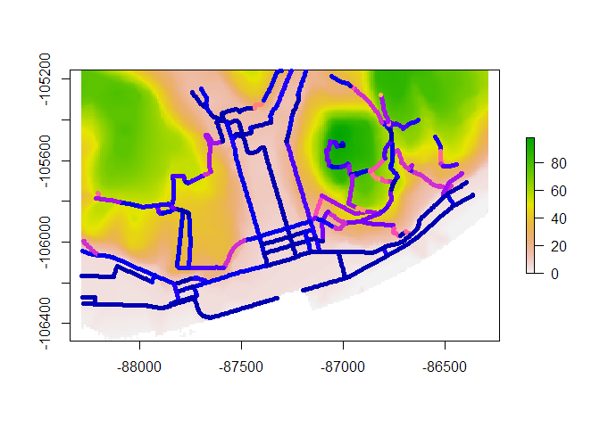
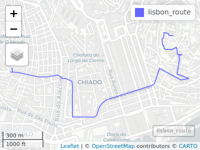
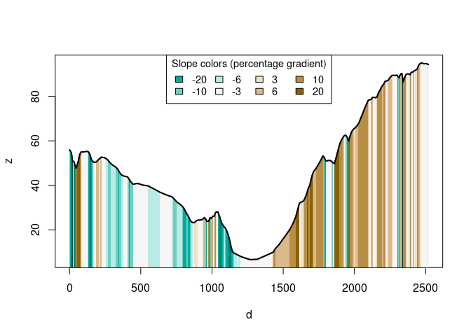
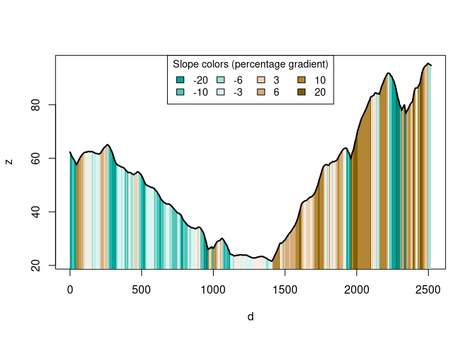

<!-- README.md is generated from README.Rmd. Please edit that file -->

# slopes package

<!-- badges: start -->

[](https://github.com/itsleeds/slopes/actions)
[](https://codecov.io/gh/itsleeds/slopes?branch=master)
[](https://github.com/ropensci/software-review/issues/420)
<!-- badges: end -->

The **slopes** R package calculates the slope (longitudinal steepness,
also known as gradient) of roads, rivers and other linear (simple)
features, based on two main inputs:

-   [vector](https://geocompr.robinlovelace.net/spatial-class.html#vector-data)
    linestring geometries defined by classes in the
    [`sf`](https://r-spatial.github.io/sf/) package
-   [raster](https://geocompr.robinlovelace.net/spatial-class.html#raster-data)
    objects with pixel values reporting average height, commonly known
    as digital elevation model (**DEM**) datasets, defined by classes in
    the [`raster`](https://cran.r-project.org/package=raster) or more
    recent [`terra`](https://rspatial.org/terra) packages

This README covers installation and basic usage. For more information
about slopes and how to use the package to calculate them, see the [get
started](https://itsleeds.github.io/slopes/) and the [introducion to
slopes](https://itsleeds.github.io/intro-to-slopes/) vignette.

## How it works

The package takes two main types of input data for slope calculation: -
vector geographic objects representing **linear features**, and -
**elevation values** from a digital elevation model representing a
continuous terrain surface or which can be downloaded using
functionality in the package

The package can be used with two sources of elevation data: - openly
available elevation data via an interface to the [ceramic
package](https://github.com/hypertidy/ceramic), enabling estimation of
hilliness for routes anywhere worldwide even when local elevation data
is lacking. The package takes geographic lines objects and returns
elevation data per vertex (providing the output as a 3D point geometry
in the sf package by default) and per line feature (providing average
gradient by default). - an elevation model, available on your machine.

## Getting started

### Installation

<!-- You can install the released version of slopes from [CRAN](https://CRAN.R-project.org) with: -->
<!-- ``` r -->
<!-- install.packages("slopes") -->
<!-- ``` -->

Install the development version from [GitHub](https://github.com/) with:

``` r
# install.packages("remotes")
remotes::install_github("itsleeds/slopes")
```

#### Installation for DEM downloads

If you do not already have DEM data and want to make use of the
package’s ability to download them using the `ceramic` package, install
the package with suggested dependencies, as follows:

``` r
# install.packages("remotes")
remotes::install_github("itsleeds/slopes", dependencies = "Suggests")
```

Furthermore, you will need to add a MapBox API key to be able to get DEM
datasets, by signing up and registering for a key at
<https://account.mapbox.com/access-tokens/> and then following these
steps:

``` r
usethis::edit_r_environ()
MAPBOX_API_KEY=xxxxx # replace XXX with your api key
```

## Basic examples

Load the package in the usual way. We will also load the `sf` library:

``` r
library(slopes)
library(sf)
```

The minimum input data requirement for using the package is an `sf`
object containing LINESTRING geometries.

### Sinlge road segment + no DEM

You can check your input dataset is suitable with the functions
`class()` from base R and `st_geometry_type()` from the `sf` package, as
demonstrated below on the example object `lisbon_road_segment` that is
contained within the package:

``` r
sf_linestring = lisbon_road_segment
class(sf_linestring)
#> [1] "sf"         "tbl_df"     "tbl"        "data.frame"
st_geometry_type(sf_linestring)
#> [1] LINESTRING
#> 18 Levels: GEOMETRY POINT LINESTRING POLYGON MULTIPOINT ... TRIANGLE
```

Don’t worry if you don’t yet have your linear features in this class:
you can read-in data from a wide range of formats into an `sf` object.

<!-- You can also create `sf` objects from a matrix of coordinates, as illustrated below (don't worry about the details for now, you can read up on how all this works in the `sf` package [documentation](https://r-spatial.github.io/sf/articles/sf1.html)): -->
<!-- ```{r, eval=FALSE, echo=FALSE} -->
<!-- m = st_coordinates(sf::st_transform(lisbon_road_segment, 4326)) -->
<!-- s = seq(from = 1, to = nrow(m), length.out = 4) -->
<!-- round(m[s, 1:2], 5) -->
<!-- dput(round(m[s, 1], 4)) -->
<!-- dput(round(m[s, 2], 4)) -->
<!-- ``` -->
<!-- ```{r} -->
<!-- m = cbind( -->
<!--   c(-9.1333, -9.134, -9.13), -->
<!--   c(38.714, 38.712, 38.710) -->
<!-- ) -->
<!-- sf_linestring = sf::st_sf( -->
<!--   data.frame(id = 1), -->
<!--   geometry = st_sfc(st_linestring(m)), -->
<!--   crs = 4326 -->
<!-- ) -->
<!-- class(sf_linestring) -->
<!-- st_geometry_type(sf_linestring) -->
<!-- ``` -->

A quick way of testing if your object can have slopes calculated for it
is to plot it in an interactive map and to check that underneath the
object there is indeed terrain that will give the linestrings gradient:

``` r
library(tmap)
tmap_mode("view")
tm_shape(sf_linestring) +
  tm_lines(lwd = 5) +
  tm_basemap(leaflet::providers$Esri.WorldTopoMap)
```


Imagine you want to calculate the gradient of the route shown above. You
can do this as a two step process as follows.

**Step 1**: add elevations to each coordinate in the linestring
(requires a [MapBox API](https://account.mapbox.com/access-tokens/)
key):

``` r
sf_linestring_xyz = elevation_add(sf_linestring)
#> Loading required namespace: ceramic
#> Preparing to download: 9 tiles at zoom = 18 from 
#> https://api.mapbox.com/v4/mapbox.terrain-rgb/
```

You can check the elevations added to the new `sf_linestring_xyz` object
by printing its coordinates, as follows (note the new Z column that goes
from above 87 m above sea level to only 79 m in a short distance).

``` r
st_coordinates(sf_linestring_xyz)
#>               X         Y        Z L1
#>  [1,] -87064.34 -105506.3 87.80116  1
#>  [2,] -87065.47 -105514.3 87.15377  1
#>  [3,] -87066.60 -105522.3 79.30441  1
#>  [4,] -87067.73 -105530.3 85.72817  1
#>  [5,] -87068.86 -105538.2 85.90000  1
#>  [6,] -87069.99 -105546.2 85.06419  1
#>  [7,] -87075.24 -105548.4 83.11215  1
#>  [8,] -87080.48 -105550.5 81.09028  1
#>  [9,] -87080.06 -105560.1 80.41115  1
#> [10,] -87079.65 -105569.6 79.72663  1
#> [11,] -87079.23 -105579.2 78.76135  1
#> [12,] -87078.81 -105588.8 77.93748  1
#> [13,] -87078.39 -105598.3 77.00873  1
#> [14,] -87069.73 -105601.7 79.73702  1
#> [15,] -87068.93 -105608.4 79.20985  1
#> [16,] -87068.14 -105615.1 78.59588  1
#> [17,] -87067.34 -105621.7 78.05968  1
#> [18,] -87062.16 -105625.7 79.19526  1
#> [19,] -87056.99 -105629.6 79.92942  1
```

You can use the `z_` functions to extract such values:

``` r
z_value(sf_linestring_xyz) # returns all the elevation values between xy coordinates
#>  [1] 87.80116 87.15377 79.30441 85.72817 85.90000 85.06419 83.11215 81.09028
#>  [9] 80.41115 79.72663 78.76135 77.93748 77.00873 79.73702 79.20985 78.59588
#> [17] 78.05968 79.19526 79.92942

z_mean(sf_linestring_xyz) # elevation mean value
#> [1] 81.24877
z_min(sf_linestring_xyz) # elevation min value 
#> [1] 77.00873
z_max(sf_linestring_xyz) # elevation max value 
#> [1] 87.80116
z_start(sf_linestring_xyz) # first z
#> [1] 87.80116
z_end(sf_linestring_xyz) # last z
#> [1] 79.92942
```

**Step 2**: calculate the average slope of the linestring

``` r
slope_xyz(sf_linestring_xyz)
#>       1 
#> 0.21318
```

The result, just over 0.2, tells us that it’s quite a steep slope: a 21%
gradient *on average*.

### Route + available DEM

Using the slopes package we can estimate the gradient of individual road
segments. When these segments are combined into routes, we then need a
means of assessing the hilliness of the entire route. A range of indices
can be used to represent route hilliness. The choice of which index is
most appropriate may be context dependent (see the [introducion to
slopes](https://itsleeds.github.io/intro-to-slopes/) vignette).

Again, let us use the same function with a entire route, `lisbon_route`,
also available in the package:

``` r
sf_route = lisbon_route
class(sf_route)
#> [1] "sf"         "tbl_df"     "tbl"        "data.frame"
st_geometry_type(sf_route)
#> [1] LINESTRING
#> 18 Levels: GEOMETRY POINT LINESTRING POLYGON MULTIPOINT ... TRIANGLE

tm_shape(sf_route) +
  tm_lines(lwd = 3) +
  tm_basemap(leaflet::providers$Esri.WorldTopoMap)
```


**Step 1**: add elevations to each coordinate in the route:

``` r
sf_route_xyz = elevation_add(sf_route)
#> Preparing to download: 12 tiles at zoom = 15 from 
#> https://api.mapbox.com/v4/mapbox.terrain-rgb/
```

**Step 2**: calculate the average slope of the route

``` r
slope_xyz(sf_route_xyz)
#>          1 
#> 0.07681812
```

The result shows a 7.7% gradient *on average*.

Now, if you already have a DEM, you can calculate the slopes directly as
follows, with `slope_raster()`:

``` r
class(dem_lisbon_raster)
#> [1] "RasterLayer"
#> attr(,"package")
#> [1] "raster"
slope_raster(routes = sf_route,
             dem = dem_lisbon_raster)
#>          1 
#> 0.07817098
```

The result shows a 7.8% gradient *on average*. As you can see, the
retrieved result from elevation information available in mapbox and in
this Digital Elevation Model, is quite similar. (See more about these
differences in [Verification of
slopes](https://itsleeds.github.io/slopes/articles/verification.html).)

### Route with xyz coordinates

If your linestring object already has X, Y and Z coordinates (e.g. from
a GPS device), you can use the `slope_` functions directly.

``` r
# for a line xz
x = c(0, 2, 3, 4, 5, 9)
elevations = c(1, 2, 2, 4, 3, 1) / 10
slope_vector(x, elevations)
#> [1]  0.05  0.00  0.20 -0.10 -0.05


# for a path xyz
xy = st_coordinates(sf_linestring)
dist = sequential_dist(xy, lonlat = FALSE)
elevations = elevation_extract(xy, dem_lisbon_raster)

slope_distance(dist, elevations)
#>  [1] -0.047226259 -0.040883072 -0.025032918 -0.061124557 -0.017447060
#>  [6] -0.062426272 -0.123580541  0.033705378  0.004292243 -0.040360003
#> [11] -0.151671893 -0.182367906  0.409246854 -0.034463974 -0.098406640
#> [16] -0.161798173  0.076261379  0.100654228
slope_distance_mean(dist, elevations)
#> [1] 0.09283052
slope_distance_weighted(dist, elevations)
#> [1] 0.09501323
```

In any case, to use the `slopes` package you need **elevation points**,
either as a vector, a matrix or as a digital elevation model (DEM)
encoded as a raster dataset.

## Calculating and plotting the gradient of roads

Typical use cases for the package are calculating the slopes of
geographic objects representing roads or other linear features. These
two types of input data are represented in the code output and plot
below.

``` r
# A raster dataset included in the package:
class(dem_lisbon_raster) # digital elevation model
#> [1] "RasterLayer"
#> attr(,"package")
#> [1] "raster"
summary(raster::values(dem_lisbon_raster)) # heights range from 0 to ~100m
#>    Min. 1st Qu.  Median    Mean 3rd Qu.    Max.    NA's 
#>   0.000   8.598  30.233  33.733  55.691  97.906    4241
raster::plot(dem_lisbon_raster)

# A vector dataset included in the package:
class(lisbon_road_segments)
#> [1] "sf"         "tbl_df"     "tbl"        "data.frame"
plot(sf::st_geometry(lisbon_road_segments), add = TRUE)
```


Calculate the average gradient of **each road segment** as follows:

``` r
lisbon_road_segments$slope = slope_raster(lisbon_road_segments, dem = dem_lisbon_raster)
summary(lisbon_road_segments$slope)
#>    Min. 1st Qu.  Median    Mean 3rd Qu.    Max. 
#> 0.00000 0.01246 0.03534 0.05462 0.08251 0.27583
```

This created a new column, `slope` that represents the average, distance
weighted slope associated with each road segment. The units represent
the percentage incline, that is the change in elevation divided by
distance. The summary of the result tells us that the average gradient
of slopes in the example data is just over 5%.

This result is equivalent to that returned by ESRI’s `Slope_3d()` in the
[3D Analyst
extension](https://desktop.arcgis.com/en/arcmap/10.3/tools/3d-analyst-toolbox/slope.htm),
with a correlation between the ArcMap implementation and our
implementation of more than 0.95 on our test dataset (we find higher
correlations on larger datasets - see the [verification of
slopes](https://itsleeds.github.io/slopes/articles/verification.html%20article):

``` r
cor(
  lisbon_road_segments$slope,    # slopes calculates by the slopes package
  lisbon_road_segments$Avg_Slope # slopes calculated by ArcMap's 3D Analyst extension
)
#> [1] 0.9770436
```

We can now visualise the average slopes of each route calculated by the
`slopes` package as follows:

``` r
raster::plot(dem_lisbon_raster)
plot(lisbon_road_segments["slope"], add = TRUE, lwd = 5)
```



Imagine that we want to go from East hilly area of the map (Santa
Catarina) to the West hilly area of the map (Castelo de São Jorge):

``` r
# library(tmap)
# tmap_mode("view")
qtm(lisbon_route)
```



We can convert the `lisbon_route` object into a 3d linestring object
with X, Y and Z coordinates, using the elevation values stored in the
DEM, as follows:

``` r
lisbon_route_xyz = elevation_add(lisbon_route, dem_lisbon_raster)
```

We can now visualise the **elevation profile** of the route as follows:

``` r
plot_slope(lisbon_route_xyz)
```



If you do not have a raster dataset representing elevations, you can
automatically download them as follows (a step that is automatically
done in the function `elevation_add()` shown in the basic example above,
results of the subsequent code chunk not shown):

``` r
dem_mapbox = elevation_get(lisbon_route)
lisbon_road_proj = st_transform(lisbon_route, raster::crs(dem_mapbox))
lisbon_route_xyz_mapbox = elevation_add(lisbon_road_proj, dem = dem_mapbox)
plot_slope(lisbon_route_xyz_mapbox)
```

As outlined in the basic example above this can be done more concisely,
as:

``` r
lisbon_route_xyz_auto = elevation_add(lisbon_route)
#> Preparing to download: 12 tiles at zoom = 15 from 
#> https://api.mapbox.com/v4/mapbox.terrain-rgb/
plot_slope(lisbon_route_xyz_auto)
```



## See more in vignettes

-   [Get
    started](https://itsleeds.github.io/slopes/articles/slopes.html)
-   [An introduction to
    slopes](https://itsleeds.github.io/slopes/articles/intro-to-slopes.html)
-   [Reproducible example: gradients of a road network for a given
    city](https://itsleeds.github.io/slopes/articles/roadnetworkcycling.html)
-   [Verification of
    slopes](https://itsleeds.github.io/slopes/articles/verification.html)
-   [Benchmarking slopes
    calculation](https://itsleeds.github.io/slopes/articles/benchmark.html)

## Code of Conduct

Please note that the slopes project is released with a [Contributor Code
of
Conduct](https://contributor-covenant.org/version/2/0/CODE_OF_CONDUCT.html).
By contributing to this project, you agree to abide by its terms.
