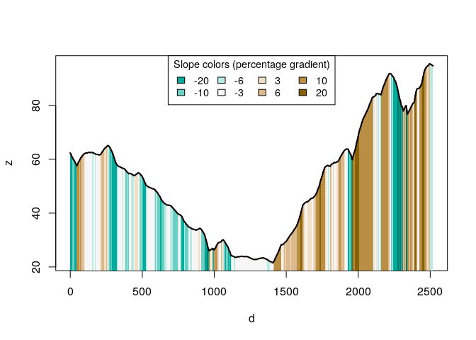

<!-- README.md is generated from README.Rmd. Please edit that file -->

# slopes

<!-- badges: start -->

[](https://github.com/itsleeds/slopes/actions)
[](https://codecov.io/gh/itsleeds/slopes?branch=master)
<!-- badges: end -->

The goal of slopes is to enable fast, accurate and user friendly
calculation longitudinal steepness of linear features such as roads and
rivers, based on commonly available input datasets such as road
geometries and digital elevation model (DEM) datasets.

## Installation

<!-- You can install the released version of slopes from [CRAN](https://CRAN.R-project.org) with: -->
<!-- ``` r -->
<!-- install.packages("slopes") -->
<!-- ``` -->

Install the development version from [GitHub](https://github.com/) with:

``` r
# install.packages("remotes")
remotes::install_github("itsleeds/slopes")
```

## Usage

Load the package in the usual way:

``` r
library(slopes)
```

We will also load the `sf` library:

``` r
library(sf)
#> Linking to GEOS 3.8.0, GDAL 3.0.4, PROJ 7.0.0
```

<!-- We will also use the `sf` package for representing road segments: -->
<!-- ```{r} -->
<!-- library(sf) -->
<!-- ``` -->

The minimum data requirements for using the package are elevation
points, either as a vector, a matrix or as a digital elevation model
(DEM) encoded as a raster dataset. Typically you will also have a
geographic object representing the roads or similar features. These two
types of input data are represented in the code output and plot below.

``` r
# A raster dataset included in the package:
class(dem_lisbon_raster) # digital elevation model
#> [1] "RasterLayer"
#> attr(,"package")
#> [1] "raster"
summary(raster::values(dem_lisbon_raster)) # heights range from 0 to ~100m
#>    Min. 1st Qu.  Median    Mean 3rd Qu.    Max.    NA's 
#>   0.000   8.598  30.233  33.733  55.691  97.906    4241
raster::plot(dem_lisbon_raster)

# A vector dataset included in the package:
class(lisbon_road_segments)
#> [1] "sf"         "tbl_df"     "tbl"        "data.frame"
plot(sf::st_geometry(lisbon_road_segments), add = TRUE)
```


Calculate the average gradient of each road segment as follows:

``` r
lisbon_road_segments$slope = slope_raster(lisbon_road_segments, e = dem_lisbon_raster)
summary(lisbon_road_segments$slope)
#>    Min. 1st Qu.  Median    Mean 3rd Qu.    Max. 
#> 0.00000 0.01246 0.03534 0.05462 0.08251 0.27583
```

This created a new column, `slope` that represents the average, distance
weighted slope associated with each road segment. The units represent
the percentage incline, that is the change in elevation divided by
distance. The summary of the result tells us that the average gradient
of slopes in the example data is just over 5%. This result is equivalent
to that returned by ESRI’s `Slope_3d()` in the [3D Analyst
extension](https://desktop.arcgis.com/en/arcmap/10.3/tools/3d-analyst-toolbox/slope.htm),
with a correlation between the ArcMap implementation and our
implementation of more than 0.95 on our test datast (we find higher
correlations on larger datasets):

``` r
cor(
  lisbon_road_segments$slope,    # slopes calculates by the slopes package
  lisbon_road_segments$Avg_Slope # slopes calculated by ArcMap's 3D Analyst extension
)
#> [1] 0.9770436
```

We can now visualise the slopes calculated by the `slopes` package as
follows:

``` r
raster::plot(dem_lisbon_raster)
plot(lisbon_road_segments["slope"], add = TRUE, lwd = 5)
```


``` r
# mapview::mapview(lisbon_road_segments["slope"], map.types = "Esri.WorldStreetMap")
```

Imagine that we want to go from Santa Catarina to the East of the map to
the Castelo de Sao Jorge to the West of the map:

``` r
mapview::mapview(lisbon_route)
```


We can convert the `lisbon_route` object into a 3d linestring object as
follows:

``` r
lisbon_route_3d = slope_3d(lisbon_route, dem_lisbon_raster)
```

We can now visualise the elevation profile of the route as follows:

``` r
plot_slope(lisbon_route_3d)
```


If you do not have a raster dataset representing elevations, you can
automatically download them as follows.

``` r
lisbon_route_3d_auto = slope_3d(r = lisbon_route)
#> Preparing to download: 12 tiles at zoom = 15 from 
#> https://api.mapbox.com/v4/mapbox.terrain-rgb/
plot_slope(lisbon_route_3d_auto)
```



# Performance

For this benchmark we will download the following small (&lt; 100 kB)
`.tif` file:

``` r
u = "https://github.com/ITSLeeds/slopes/releases/download/0.0.0/dem_lisbon.tif"
if(!file.exists("dem_lisbon.tif")) download.file(u, "dem_lisbon.tif")
```

A benchmark can reveal how many route gradients can be calculated per
second:

``` r
e = dem_lisbon_raster
r = lisbon_road_segments
et = terra::rast("dem_lisbon.tif")
res = bench::mark(check = FALSE,
  slope_raster = slope_raster(r, e),
  slope_terra = slope_raster(r, et)
)
```

``` r
res
#> # A tibble: 2 x 6
#>   expression        min   median `itr/sec` mem_alloc `gc/sec`
#>   <bch:expr>   <bch:tm> <bch:tm>     <dbl> <bch:byt>    <dbl>
#> 1 slope_raster   52.3ms   58.4ms      17.5    5.72MB     5.01
#> 2 slope_terra    79.8ms   80.6ms      12.4    2.21MB    12.4
```

That is approximately

``` r
round(res$`itr/sec` * nrow(r))
#> [1] 4748 3348
```

routes per second using the `raster` and `terra` (the default if
installed, using `RasterLayer` and native `SpatRaster` objects) packages
to extract elevation estimates from the raster datasets, respectively.

The message: use the `terra` package to read-in DEM data for slope
extraction if speed is important.

To go faster, you can chose the `simple` method to gain some speed at
the expense of accuracy:

``` r
e = dem_lisbon_raster
r = lisbon_road_segments
res = bench::mark(check = FALSE,
  bilinear1 = slope_raster(r, e),
  bilinear2 = slope_raster(r, et),
  simple1 = slope_raster(r, e, method = "simple"),
  simple2 = slope_raster(r, et, method = "simple")
)
```

``` r
res
#> # A tibble: 4 x 6
#>   expression      min   median `itr/sec` mem_alloc `gc/sec`
#>   <bch:expr> <bch:tm> <bch:tm>     <dbl> <bch:byt>    <dbl>
#> 1 bilinear1    60.6ms   63.7ms      15.8    5.72MB     5.26
#> 2 bilinear2    94.2ms   97.5ms      10.3    2.17MB     5.15
#> 3 simple1        53ms   55.8ms      18.2    2.05MB     5.19
#> 4 simple2      90.8ms   96.2ms      10.4    2.17MB     6.94
```
