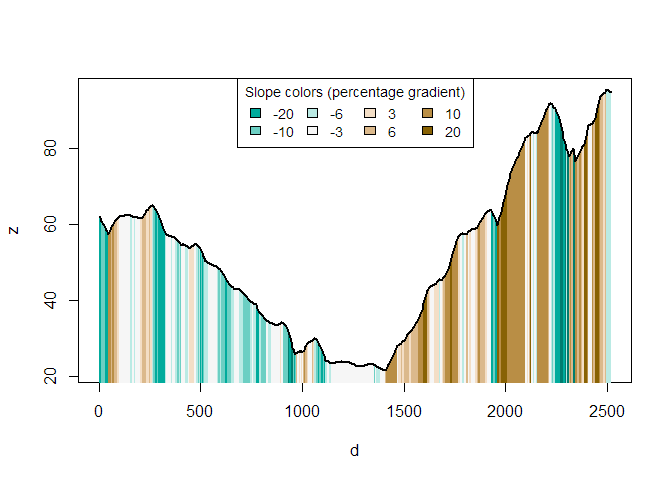

<!-- README.md is generated from README.Rmd. Please edit that file -->

# slopes

<!-- badges: start -->

[](https://github.com/itsleeds/slopes/actions)
[](https://codecov.io/gh/itsleeds/slopes?branch=master)
[](https://github.com/ropensci/software-review/issues/420)
<!-- badges: end -->

This package calculates longitudinal steepness of linear features such
as roads and rivers, based on two main inputs: vector linestring
geometries and raster digital elevation model (DEM) datasets.

## Installation

<!-- You can install the released version of slopes from [CRAN](https://CRAN.R-project.org) with: -->
<!-- ``` r -->
<!-- install.packages("slopes") -->
<!-- ``` -->

Install the development version from [GitHub](https://github.com/) with:

``` r
# install.packages("remotes")
remotes::install_github("itsleeds/slopes")
```

If you do not already have DEM data and want to make use of the
package’s ability to download them using the `ceramic` package, install
the package with suggested dependencies as follows:

``` r
# install.packages("remotes")
remotes::install_github("itsleeds/slopes", dependencies = "Suggests")
```

Furthermore, you will need to add a MapBox API key to be able to get DEM
datasets, by signing up and registering for a key at
<https://account.mapbox.com/access-tokens/> and then following these
steps:

``` r
usethis::edit_r_environ()
# Type in (register on the mapbox website):
MAPBOX_API_KEY=xxxxx
```

## Usage

Load the package in the usual way:

``` r
library(slopes)
```

We will also load the `sf` library:

``` r
library(sf)
#> Warning: package 'sf' was built under R version 4.0.5
#> Linking to GEOS 3.9.0, GDAL 3.2.1, PROJ 7.2.1
```

The minimum data requirements for using the package are elevation
points, either as a vector, a matrix or as a digital elevation model
(DEM) encoded as a raster dataset. Typically you will also have a
geographic object representing the roads or similar features. These two
types of input data are represented in the code output and plot below.

``` r
# A raster dataset included in the package:
class(dem_lisbon_raster) # digital elevation model
#> [1] "RasterLayer"
#> attr(,"package")
#> [1] "raster"
summary(raster::values(dem_lisbon_raster)) # heights range from 0 to ~100m
#>    Min. 1st Qu.  Median    Mean 3rd Qu.    Max.    NA's 
#>   0.000   8.598  30.233  33.733  55.691  97.906    4241
raster::plot(dem_lisbon_raster)

# A vector dataset included in the package:
class(lisbon_road_segments)
#> [1] "sf"         "tbl_df"     "tbl"        "data.frame"
plot(sf::st_geometry(lisbon_road_segments), add = TRUE)
```


Calculate the average gradient of each road segment as follows:

``` r
lisbon_road_segments$slope = slope_raster(lisbon_road_segments, dem = dem_lisbon_raster)
summary(lisbon_road_segments$slope)
#>    Min. 1st Qu.  Median    Mean 3rd Qu.    Max. 
#> 0.00000 0.01246 0.03534 0.05462 0.08251 0.27583
```

This created a new column, `slope` that represents the average, distance
weighted slope associated with each road segment. The units represent
the percentage incline, that is the change in elevation divided by
distance. The summary of the result tells us that the average gradient
of slopes in the example data is just over 5%. This result is equivalent
to that returned by ESRI’s `elevation_add()` in the [3D Analyst
extension](https://desktop.arcgis.com/en/arcmap/10.3/tools/3d-analyst-toolbox/slope.htm),
with a correlation between the ArcMap implementation and our
implementation of more than 0.95 on our test dataset (we find higher
correlations on larger datasets):

``` r
cor(
  lisbon_road_segments$slope,    # slopes calculates by the slopes package
  lisbon_road_segments$Avg_Slope # slopes calculated by ArcMap's 3D Analyst extension
)
#> [1] 0.9770436
```

We can now visualise the slopes calculated by the `slopes` package as
follows:

``` r
raster::plot(dem_lisbon_raster)
plot(lisbon_road_segments["slope"], add = TRUE, lwd = 5)
```


``` r
# mapview::mapview(lisbon_road_segments["slope"], map.types = "Esri.WorldStreetMap")
```

Imagine that we want to go from Santa Catarina to the East of the map to
the Castelo de Sao Jorge to the West of the map:

``` r
library(tmap)
#> Warning: package 'tmap' was built under R version 4.1.0
tmap_mode("view")
#> tmap mode set to interactive viewing
qtm(lisbon_route)
```


We can convert the `lisbon_route` object into a 3d linestring object as
follows:

``` r
lisbon_route_3d = elevation_add(lisbon_route, dem_lisbon_raster)
```

We can now visualise the elevation profile of the route as follows:

``` r
plot_slope(lisbon_route_3d)
```


If you do not have a raster dataset representing elevations, you can
automatically download them as follows.

``` r
lisbon_route_3d_auto = elevation_add(lisbon_route)
#> Preparing to download: 12 tiles at zoom = 15 from 
#> https://api.mapbox.com/v4/mapbox.terrain-rgb/
plot_slope(lisbon_route_3d_auto)
```


