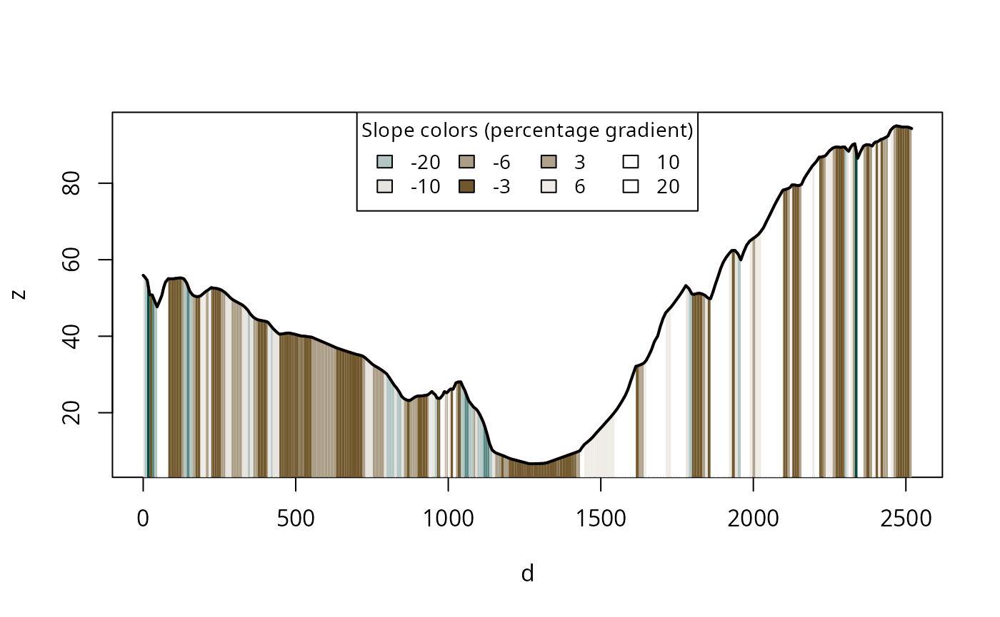
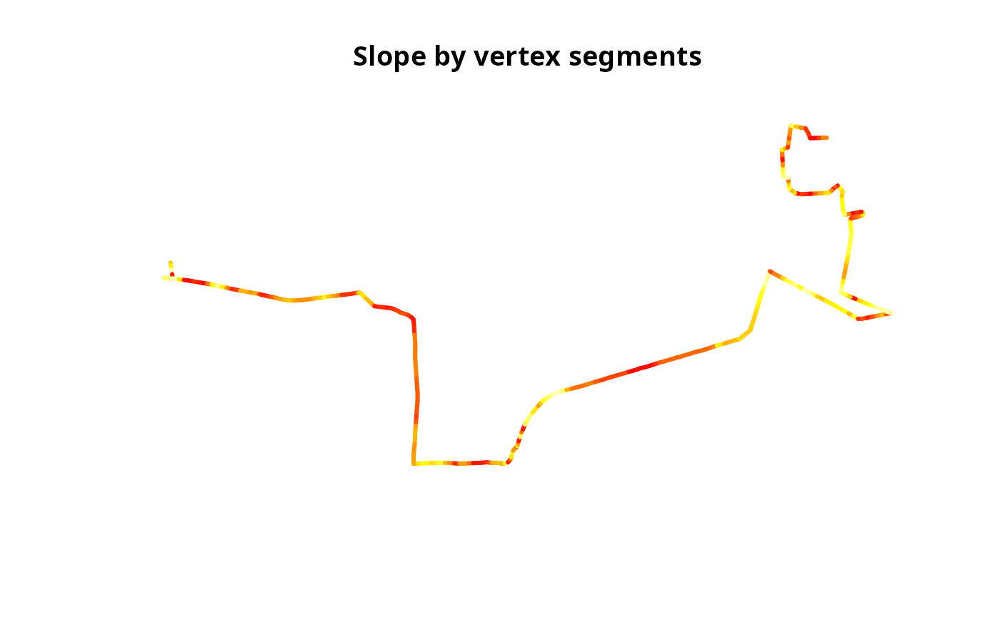
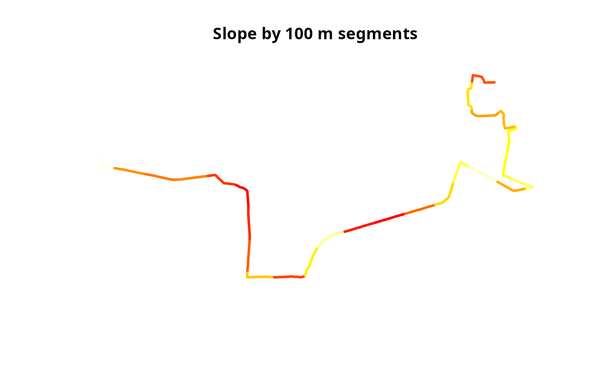

# Get started

Welcome to the slopes vignette, a type of long-form
documentation/article that introduces the core functions and
functionality of the `slopes` package.

## Installation

You can install the released version of slopes from
[CRAN](https://CRAN.R-project.org) with:

``` r
install.packages("slopes")
```

Install the development version from [GitHub](https://github.com/) with:

``` r
# install.packages("remotes")
remotes::install_github("ropensci/slopes")
```

#### Installation for DEM downloads

If you do not already have DEM data and want to make use of the
package’s ability to download them using the `ceramic` package, install
the package with suggested dependencies, as follows:

``` r
# install.packages("remotes")
remotes::install_github("ropensci/slopes", dependencies = "Suggests")
```

Furthermore, you will need to add a MapBox API key to be able to get DEM
datasets, by signing up and registering for a key at
`https://account.mapbox.com/access-tokens/` and then following these
steps:

``` r
usethis::edit_r_environ()
# Then add the following line to the file that opens:
# MAPBOX_API_KEY=xxxxx # replace XXX with your api key
```

## Functions

### Elevation

- [`elevation_add()`](https://docs.ropensci.org/slopes/reference/elevation_add.md)
  Take a linestring and add a third dimension (z) to its coordinates
- [`elevation_get()`](https://docs.ropensci.org/slopes/reference/elevation_get.md)
  Get elevation data from hosted maptile services (returns a
  `SpatRaster`)
- [`elevation_extract()`](https://docs.ropensci.org/slopes/reference/elevation_extract.md)
  Extract elevations from coordinates

### Slope calculation

- [`slope_vector()`](https://docs.ropensci.org/slopes/reference/slope_vector.md)
  Calculate the gradient of line segments from distance and elevation
  vectors
- [`slope_distance()`](https://docs.ropensci.org/slopes/reference/slope_distance.md)
  Calculate the slopes associated with consecutive distances and
  elevations
- [`slope_distance_mean()`](https://docs.ropensci.org/slopes/reference/slope_distance_mean.md)
  Calculate the mean average slopes associated with consecutive
  distances and elevations
- [`slope_distance_weighted()`](https://docs.ropensci.org/slopes/reference/slope_distance_weighted.md)
  Calculate the slopes associated with consecutive distances and
  elevations, weighted by distance
- [`slope_matrix()`](https://docs.ropensci.org/slopes/reference/slope_matrix.md)
  Calculate the slope of lines based on a DEM matrix
- [`slope_matrix_mean()`](https://docs.ropensci.org/slopes/reference/slope_matrix_mean.md)
  Calculate the mean slope of lines based on a DEM matrix
- [`slope_matrix_weighted()`](https://docs.ropensci.org/slopes/reference/slope_matrix_weighted.md)
  Calculate the weighted mean slope of lines based on a DEM matrix
- [`slope_raster()`](https://docs.ropensci.org/slopes/reference/slope_raster.md)
  Calculate the slope of lines based on a raster DEM
- [`slope_xyz()`](https://docs.ropensci.org/slopes/reference/slope_xyz.md)
  Calculate the slope of lines based on XYZ coordinates

### Plotting

- [`plot_slope()`](https://docs.ropensci.org/slopes/reference/plot_slope.md)
  Plot slope data for a 3d linestring

### Helper functions

- [`sequential_dist()`](https://docs.ropensci.org/slopes/reference/sequential_dist.md)
  Calculate cumulative distances along a linestring
- `z_value()` Extract Z coordinates from an `sfc` object
- `z_start()` Get the starting Z coordinate
- `z_end()` Get the ending Z coordinate
- `z_mean()` Calculate the mean Z coordinate
- `z_max()` Get the maximum Z coordinate
- `z_min()` Get the minimum Z coordinate
- `z_elevation_change_start_end()` Calculate the elevation change from
  start to end
- `z_direction()` Determine the direction of slope (uphill/downhill)
- `z_cumulative_difference()` Calculate the cumulative elevation
  difference

## Examples

This section shows some basic examples of how to use the `slopes`
package.

First, load the necessary packages and data:

``` r
library(slopes)
library(sf)
#> Linking to GEOS 3.12.2, GDAL 3.8.4, PROJ 9.4.0; sf_use_s2() is TRUE
#> WARNING: different compile-time and runtime versions for GEOS found:
#> Linked against: 3.12.2-CAPI-1.18.2 compiled against: 3.12.1-CAPI-1.18.1
#> It is probably a good idea to reinstall sf (and maybe lwgeom too)

# Load example data
data(lisbon_route)
dem_lisbon <- dem_lisbon()
```

### Add elevation to a linestring

If you have a 2D linestring and a DEM, you can add elevation data to the
linestring using
[`elevation_add()`](https://docs.ropensci.org/slopes/reference/elevation_add.md):

``` r
sf_linestring_xyz_local <- elevation_add(lisbon_route, dem = dem_lisbon)
head(sf::st_coordinates(sf_linestring_xyz_local))
#>              X         Y        Z L1
#> [1,] -88202.31 -105757.6 55.91552  1
#> [2,] -88201.67 -105762.3 55.52176  1
#> [3,] -88200.54 -105770.5 54.62495  1
#> [4,] -88199.42 -105778.7 50.82914  1
#> [5,] -88198.29 -105786.9 50.76749  1
#> [6,] -88205.89 -105786.3 49.22162  1
```

If you don’t have a local DEM,
[`elevation_add()`](https://docs.ropensci.org/slopes/reference/elevation_add.md)
can download elevation data (this requires a MapBox API key and the
`ceramic` package):

``` r
# Requires a MapBox API key and the ceramic package
# sf_linestring_xyz_mapbox = elevation_add(lisbon_route)
# head(sf::st_coordinates(sf_linestring_xyz_mapbox))
```

### Calculate slope

Once you have a 3D linestring (with XYZ coordinates), you can calculate
its average slope using
[`slope_xyz()`](https://docs.ropensci.org/slopes/reference/slope_xyz.md):

``` r
slope <- slope_xyz(sf_linestring_xyz_local)
slope
#>          1 
#> 0.07817098
```

### Plot elevation profile

You can visualize the elevation profile of a 3D linestring using
[`plot_slope()`](https://docs.ropensci.org/slopes/reference/plot_slope.md):

``` r
# ensure a palette and breaks exist
brks <- c(3, 6, 10, 20, 40, 100)
pal <- slopes_palette(length(brks) - 1)

plot_slope(sf_linestring_xyz_local, pal = pal, brks = brks)
```



### Working with segments

The `slopes` package can also work with individual segments of a
linestring. There are two ways to split a route into segments:

#### By vertex (native segments of the linestring)

[`route_to_segments()`](https://docs.ropensci.org/slopes/reference/route_to_segments.md)
splits the route at every existing vertex, producing one 2-point segment
per coordinate pair:

``` r
lisbon_route_xyz <- elevation_add(lisbon_route, dem = dem_lisbon())
lisbon_route_segments_xyz <- route_to_segments(lisbon_route_xyz)
lisbon_route_segments_xyz$slope <- slope_xyz(lisbon_route_segments_xyz)
summary(lisbon_route_segments_xyz$slope)
#>      Min.   1st Qu.    Median      Mean   3rd Qu.      Max.       NAs 
#> 0.0001026 0.0239350 0.0545492 0.0770948 0.1076403 0.4570354        24
```

``` r
plot(st_geometry(lisbon_route_segments_xyz),
  col = heat.colors(length(lisbon_route_segments_xyz$slope))[rank(lisbon_route_segments_xyz$slope)],
  lwd = 3, main = "Slope by vertex segments"
)
```



#### By fixed length (using stplanr)

[`stplanr::line_segment()`](https://docs.ropensci.org/stplanr/reference/line_segment.html)
splits the route into segments of a given length (e.g. 100 m). Elevation
must be added after segmenting, since the new endpoints won’t have Z
coordinates yet:

``` r
lisbon_route_100m <- stplanr::line_segment(lisbon_route, segment_length = 100)
lisbon_route_100m_xyz <- elevation_add(lisbon_route_100m, dem = dem_lisbon())
lisbon_route_100m_xyz$slope <- slope_xyz(lisbon_route_100m_xyz)
summary(lisbon_route_100m_xyz$slope)
#>    Min. 1st Qu.  Median    Mean 3rd Qu.    Max. 
#> 0.01366 0.04364 0.06697 0.07822 0.11096 0.16180
```

``` r
plot(st_geometry(lisbon_route_100m_xyz),
  col = heat.colors(length(lisbon_route_100m_xyz$slope))[rank(lisbon_route_100m_xyz$slope)],
  lwd = 3, main = "Slope by 100 m segments"
)
```



This vignette provides a basic overview. For more detailed information
and advanced use cases, please refer to the other vignettes and the
function documentation.
