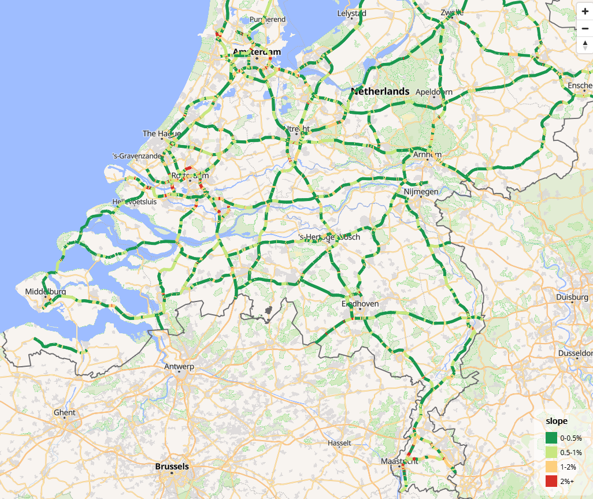

# Verification of slopes

### Introduction

This article aims to provide external verification of the results
provided by the package. So far only one verification dataset has been
used, but we hope to find others. If you know of verification datasets,
please let us know — initially we planned to use a dataset from a paper
on river slopes (Cohen et al. 2018), but we could find no way of
extracting the underlying data to do the calculation.

For this article we primarily used the following packages, although
others are loaded in subsequent code chunks.

``` r
library(slopes)
library(sf)
#> Linking to GEOS 3.12.2, GDAL 3.8.4, PROJ 9.4.0; sf_use_s2() is TRUE
#> WARNING: different compile-time and runtime versions for GEOS found:
#> Linked against: 3.12.2-CAPI-1.18.2 compiled against: 3.12.1-CAPI-1.18.1
#> It is probably a good idea to reinstall sf (and maybe lwgeom too)
```

The results are reproducible (requires downloading input data manually
and installing additional packages). To keep package build times low,
only the results are presented below.

### Case studies

#### Roads in the Netherlands

``` r
u = "https://downloads.rijkswaterstaatdata.nl/nwb-wegen/geogegevens/shapefile/NWB_hoogtebestand/01-10-2024%20Hoogtes%20Rijkswegen.zip"
f_zip = "NWB_hoogtebestand.zip"
if (!file.exists(f_zip)) {
  download.file(u, f_zip)
  unzip(f_zip)
  # Datasets in 
  list.files("NWB3D_resultaten_oktober_2024.gdb")
  roads_nl_layers = sf::st_layers("NWB3D_resultaten_oktober_2024.gdb")
#   Driver: OpenFileGDB
# Available layers:
#                                   layer_name        geometry_type features
# 1    NWB3D_resultaten_oktober_2024_wegvakken 3D Multi Line String    16456
# 2 NWB3D_resultaten_oktober_2024_vertexpunten             3D Point  1095615
#   fields            crs_name
# 1     59 Amersfoort / RD New
# 2     59 Amersfoort / RD New
  roads_nl = sf::st_read("NWB3D_resultaten_oktober_2024.gdb", layer = "NWB3D_resultaten_oktober_2024_wegvakken")
  names(roads_nl)
#    [1] "WVK_ID"        "BST_CODE"      "WVK_BEGDAT"    "JTE_ID_BEG"
#  [5] "JTE_ID_END"    "WEGBEHSRT"     "WEGNUMMER"     "WEGDEELLTR"
#  [9] "HECTO_LTTR"    "RPE_CODE"      "ADMRICHTNG"    "RIJRICHTNG"
# [13] "STT_NAAM"      "STT_BRON"      "WPSNAAM"       "GME_ID"
# [17] "GME_NAAM"      "HNRSTRLNKS"    "HNRSTRRHTS"    "E_HNR_LNKS"
# [21] "E_HNR_RHTS"    "L_HNR_LNKS"    "L_HNR_RHTS"    "BEGAFSTAND"
# [25] "ENDAFSTAND"    "BEGINKM"       "EINDKM"        "POS_TV_WOL"
# [29] "WEGBEHCODE"    "WEGBEHNAAM"    "DISTRCODE"     "DISTRNAAM"
# [33] "DIENSTCODE"    "DIENSTNAAM"    "WEGTYPE"       "WGTYPE_OMS"
# [37] "ROUTELTR"      "ROUTENR"       "ROUTELTR2"     "ROUTENR2"
# [41] "ROUTELTR3"     "ROUTENR3"      "ROUTELTR4"     "ROUTENR4"
# [45] "WEGNR_AW"      "WEGNR_HMP"     "GEOBRON_ID"    "GEOBRON_NM"
# [49] "BRONJAAR"      "OPENLR"        "BAG_ORL"       "FRC"
# [53] "FOW"           "ALT_NAAM"      "ALT_NR"        "REL_HOOGTE"
# [57] "Hoogte_bron"   "Kwaliteitlaag" "SHAPE_Length"  "SHAPE"
# Plot the slopes (variable called REL_HOOGTE):
  summary(roads_nl$REL_HOOGTE)
  # xyz 
  roads_nl_xyz = sf::st_coordinates(roads_nl)
  head(roads_nl_xyz)
  hist(roads_nl_xyz[, "Z"], breaks = 50, main = "Histogram of elevation values (m)", xlab = "Elevation (m)")
  plot(roads_nl["REL_HOOGTE"])
  summary(sf::st_geometry_type(roads_nl))
  roads_nl$slope = roads_nl |>
    sf::st_cast("LINESTRING") |>
    slopes::slope_xyz() * 100
  
  summary(roads_nl$slope)
  library(tmap)
  library(tmap.mapgl)
  m = tm_shape(roads_nl) +
    tm_lines(
      col = "slope",
      col.scale = tm_scale_intervals(
        breaks = c(-1, 0.5, 1, 2, 20),
        labels = c("0-0.5%", "0.5-1%", "1-2%", "2%+"),
        values = cols4all::c4a("-brewer.rd_yl_gn")
      ),
      lwd = 5
  )
  tmap_mode("maplibre")
  m
}

# DEM for eu:
install.packages("CopernicusDEM")
system("msiexec.exe /i https://awscli.amazonaws.com/AWSCLIV2.msi")
# Test it's installed:
system("aws --version")
# Find location of aws cli from powershell (equivalent of `which aws` on Linux):
# Get-Command aws | Select-Object -ExpandProperty Source
# C:\Program Files\Amazon\AWSCLIV2\aws.exe
current_path = Sys.getenv("PATH")

aws_path = "C:\\Program Files\\Amazon\\AWSCLIV2"
new_path = paste(aws_path, current_path, sep = ";")
Sys.setenv(PATH = new_path)
# Now aws should work
system("aws --version")
# Download DEM for Brussels 6 km from center
zones = zonebuilder::zb_zone("Brussels", n_circles = 3)
region = sf::st_union(zones$geometry) |>
  sf::st_make_valid() 
sf::sf_use_s2(TRUE) # disable s2 for this operation
region_plus_100m = sf::st_buffer(region, dist = 100)
mapview::mapview(region) + 
  mapview::mapview(region_plus_100m)
sf::sf_use_s2(FALSE) # disable s2 for this operation
dir_save_tifs = "dems-brussels"
dem = CopernicusDEM::aoi_geom_save_tif_matches(
  sf_or_file = region_plus_100m,
  dir_save_tifs = dir_save_tifs,
  resolution = 30,
  crs_value = 4326,
  threads = parallel::detectCores(),
  verbose = TRUE
)
dems = list.files(dir_save_tifs, full.names = TRUE)
dem_terra = terra::rast(dems)
names(dem_terra)
dem_cropped = terra::crop(dem_terra, region_plus_100m)
mapview::mapview(dem_cropped)
travel_network = osmactive::get_travel_network(
  region,
  boundary = region,
  boundary_type = "clipsrc"
)
plot(travel_network$geometry)
travel_network = travel_network |>
  sf::st_filter(region, .predicate = sf::st_within)

cycle_net = osmactive::get_cycling_network(travel_network)
drive_net = osmactive::get_driving_network(travel_network)
cycle_net = osmactive::distance_to_road(cycle_net, drive_net)
cycle_net = osmactive::classify_cycle_infrastructure(cycle_net, include_mixed_traffic = TRUE)
names(cycle_net)
mapview::mapview(cycle_net, zcol = "cycle_segregation")
nrow(cycle_net)
# Calculate slopes with the slopes package:
# Add elevation to cycle network segments

sf::st_crs(dem_cropped) == sf::st_crs(cycle_net)
# check the extents of both:
mapview::mapview(dem_cropped) + mapview::mapview(cycle_net)

cycle_net_clean = sf::st_cast(cycle_net, "LINESTRING")
cycle_net_xyz = elevation_add(cycle_net_clean, dem = dem_cropped)
summary(sf::st_geometry_type(cycle_net_xyz))

# Calculate slopes for each segment
cycle_net_xyz$slope = slope_xyz(cycle_net_xyz, lonlat = TRUE, fun = slope_matrix_weighted)
# cycle_net_xyz$slope = slope_xyz(cycle_net_xyz, lonlat = TRUE, fun = slope_matrix_mean)
summary(cycle_net_xyz$slope)
# Convert to percentage:
cycle_net_xyz = cycle_net_xyz |>
  # Convert to factor with greater than 5 being "5+"
  dplyr::mutate(
    slope_percent = dplyr::case_when(
      slope < 0.02 ~ as.character("0-2"),
      slope < 0.05 ~ as.character("2-5"),
      slope < 0.08 ~ as.character("5-8"),
      TRUE ~ "8+"
    )
  )
table(cycle_net_xyz$slope_percent)

# Drop z dimension
cycle_net_slopes = sf::st_zm(cycle_net_xyz) |>
  dplyr::transmute(osm_id, highway, cycle_segregation, slope = round(slope, 3), slope_percent)
summary(duplicated(cycle_net_slopes$geometry))
mapview::mapview(cycle_net_slopes, zcol = "slope_percent", legend = TRUE)
sf::write_sf(cycle_net_slopes, "cycle_net_slopes_brussels.gpkg", delete_dsn = TRUE)
system("gh release upload v1.0.1 cycle_net_slopes_brussels.gpkg --clobber")
cycle_net_slopes = sf::read_sf("cycle_net_slopes_brussels.gpkg")

# install cran version
remotes::install_dev("tmap")
# Save with tmap
library(tmap)
v = cols4all::c4a("brewer.rd_yl_gn", n = 4) |>
  rev()
m = tm_shape(cycle_net_slopes) +
  tm_lines(
    col = "slope_percent",
    col.scale = tm_scale(values = v),
    lwd = 2,
    popup.vars = FALSE
)
m
tmap_save(m, "cycle_net_slopes_brussels.html")
browseURL("cycle_net_slopes_brussels.html")
system("gh release upload v1.0.1 cycle_net_slopes_brussels.html --clobber")
# url of the file:
u_release = "https://github.com/ropensci/slopes/releases/download/v1.0.1/cycle_net_slopes_brussels.html"
download.file(u_release, "cycle_net_slopes_brussels.html")
```



Example from the Netherlands

## Comparison with results from ArcMap 3D Analyst

## Three-dimensional traces of roads dataset

An input dataset, comprising a 3D linestring recorded using a dual
frequency GNSS receiver (a [Leica
1200](https://gef.nerc.ac.uk/equipment/gnss/)) with a vertical accuracy
of 20 mm (Ariza-López et al. 2019) was downloaded from the [figshare
website as a .zip file](https://ndownloader.figshare.com/files/14331185)
and unzipped and inflated in the working directory as follows (not
evaluated to reduce package build times):

``` r
download.file("https://ndownloader.figshare.com/files/14331185", "3DGRT_AXIS_EPSG25830_v2.zip")
unzip("3DGRT_AXIS_EPSG25830_v2.zip")
trace = sf::read_sf("3DGRT_AXIS_EPSG25830_v2.shp")
plot(trace)
nrow(trace)
#> 11304
summary(trace$X3DGRT_h)
#>  Min. 1st Qu.  Median    Mean 3rd Qu.    Max. 
#>   642.9   690.3   751.4   759.9   834.3   884.9 
```

To verify our estimates of hilliness, we generated slope estimates for
each segment and compared them with [Table
7](https://www.nature.com/articles/s41597-019-0147-x/tables/7) in
Ariza-López et al. (2019). The absolute gradient measure published in
that paper were:

``` r
res_gps = c(0.00, 4.58, 1136.36, 6.97)
res_final = c(0.00, 4.96, 40.70, 3.41)
res = data.frame(cbind(
  c("GPS", "Dual frequency GNSS receiver"),
  rbind(res_gps, res_final)
))
names(res) = c("Source", "min", " mean", " max", " stdev")
knitr::kable(res, row.names = FALSE)
```

| Source                       | min | mean | max     | stdev |
|:-----------------------------|:----|:-----|:--------|:------|
| GPS                          | 0   | 4.58 | 1136.36 | 6.97  |
| Dual frequency GNSS receiver | 0   | 4.96 | 40.7    | 3.41  |

``` r
# mapview::mapview(trace) # check extent: it's above 6km in height
# remotes::install_github("hypertidy/ceramic")
loc = colMeans(sf::st_coordinates(sf::st_transform(trace, 4326)))
e = ceramic::cc_elevation(loc = loc[1:2], buffer = 3000)
trace_projected = sf::st_transform(trace, 3857)
plot(e)
plot(trace_projected$geometry, add = TRUE)
```


The slopes were estimated as follows:

``` r
# source: https://www.robinlovelace.net/presentations/munster.html#31
points2line_trajectory = function(p) {
  c = st_coordinates(p)
  i = seq(nrow(p) - 2)
  l = purrr::map(i, ~ sf::st_linestring(c[.x:(.x + 1), ]))
  lfc = sf::st_sfc(l)
  a = seq(length(lfc)) + 1 # sequence to subset
  p_data = cbind(sf::st_set_geometry(p[a, ], NULL))
  sf::st_sf(p_data, geometry = lfc)
}
r = points2line_trajectory(trace_projected)
# summary(st_length(r)) # mean distance is 1m! Doesn't make sense, need to create segments
s = slope_raster(r, e = e)
slope_summary = data.frame(min = min(s), mean = mean(s), max = max(s), stdev = sd(s))
slope_summary = slope_summary * 100
knitr::kable(slope_summary, digits = 1)
```

| min | mean |  max | stdev |
|----:|-----:|-----:|------:|
|   0 |  6.2 | 48.2 |   5.6 |

Combined with the previous table from Ariza-López et al. (2019), these
results can be compared with those obtained from mainstream GPS, and an
accurate GNSS receiver:

| Source                       | min | mean | max     | stdev |
|:-----------------------------|:----|:-----|:--------|:------|
| GPS                          | 0   | 4.58 | 1136.36 | 6.97  |
| Dual frequency GNSS receiver | 0   | 4.96 | 40.7    | 3.41  |
| Slopes R package             | 0   | 6.2  | 48.2    | 5.6   |

It is notable that the package substantially overestimates the gradient,
perhaps due to the low resolution of the underlying elevation raster.
However, the slopes package seems to provide less noisy slope estimates
than the GPS approach, with lower maximum values and low standard
deviation.

## References

Ariza-López, Francisco Javier, Antonio Tomás Mozas-Calvache, Manuel
Antonio Ureña-Cámara, and Paula Gil de la Vega. 2019. “Dataset of
Three-Dimensional Traces of Roads.” *Scientific Data* 6 (1): 1–10.
<https://doi.org/10.1038/s41597-019-0147-x>.

Cohen, Sagy, Tong Wan, Md Tazmul Islam, and J. P. M. Syvitski. 2018.
“Global River Slope: A New Geospatial Dataset and Global-Scale
Analysis.” *Journal of Hydrology* 563 (August): 1057–67.
<https://doi.org/10.1016/j.jhydrol.2018.06.066>.
