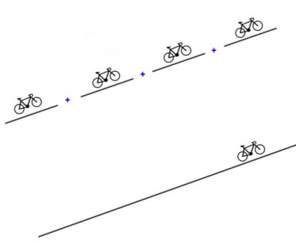

```{r, include = FALSE}
knitr::opts_chunk$set(
  collapse = TRUE,
  comment = "#>"
)
```

# Introduction

Slopes are important for many purposes, including flood risk, agriculture, geology, and infrastructure constructions. The information about slopes is very relevant for vehicle routing modes that are sensitive to going up or down steep hills (e.g. bicycles, trains, and large trucks).  
{ width=10% }  

Although there are several ways to name "slope", such as "steepness", "hilliness", "inclination", "aspect", "gradient", "declivity", the referred `slopes` in this package can be defined as the "longitudinal gradient" [@cohen_global_2018].

# Calculating slopes

The most common slope calculation method is defined by the vertical difference of the final and start point or line height (z1 and z0) divided by the horizontal length that separates them.

$$
s = \Delta z/l
$$

Depending on the purpose of application, it might me relevant to understand how hilliness is estimated.  

# Implementation in the slopes package

Using the `slopes` package we can estimate the gradient of individual road segments. When these segments are combined into routes, we then need a means of assessing the hilliness of the entire route. A range of indices can be used to represent route hilliness. The choice of which index is most appropriate may be context dependent.

To help research slopes using open source software for reproducibility, we have developed the slopes package.
After you have installed it, load it as follows:

```{r setup}
library(slopes)
```

<!-- ... small example from readme? ... -->
<!-- # Thoughts -->

## Segments in a route: Cumulative slope 

The lenght of a segment in a route is also a relevant factor to have in consideration. 
If it is ok to bike through a segment of 8% with $x$ lenght, it is not so ok to bike in four segments in a row like that one (8% for 4$x$ length), as illustrated in Figure \@ref(fig:cumulative-slopes).

```{r cumulative-slopes, fig.cap="Illustration of the importance of slope length. 4 segments with an 8% gradient is not the same as a single segment with a gradient of 8%.", out.width="40%", echo=FALSE}

```

This is accounted for in slope calculation methods that take the distance-weighted mean of slopes.

```{r}
x = c(0, 2, 3, 4, 5, 9)
y = c(0, 0, 0, 0, 0, 9)
z = c(1, 2, 2, 4, 3, 1) / 10
m = cbind(x, y, z)
d = sequential_dist(m = m, lonlat = FALSE)
slopes::slope_distance_weighted(d = d, e = z)
slopes::slope_distance_mean(d = d, e = z)
```

The slope estimate that results from the distance-weighted mean is lower than the simple mean.
This is common: steep slopes tend to be short.
A graphical representation of the scenario demonstrated above is shown in Figure \@ref(fig:weighted), that shows the relatively long and flat final segment reduces the slope by half.

```{r weighted, fig.cap="Illustration of example data that demonstrates distance-weighted mean gradient, used by default in the slopes package."}
plot(x, z, ylim = c(-0.5, 0.5), type = "l")
(gxy = slope_matrix(m, lonlat = FALSE))
abline(h = 0, lty = 2)
points(x[-length(x)], gxy, col = "blue")
title("Distance elevation profile",
  sub = "Points show calculated gradients of subsequent lines")
```

## Measures of route hilliness

There are many ways to measure hilliness, mean distance weighted hilliness being perhaps the most common.
These measures, and their implementation (or current lack thereof) in the package is summarised below.

- Mean distance weighted gradient. Perhaps the simplest and most widely applicable measure is the mean gradient of the route. This should be weighted by the distance of each segment. Implemented by default in the `slope_raster()` function.

- Max gradient. For activities like cycling, where steep hills have a disproportionate impact, it may be useful to consider the maximum gradient. Not yet implemented.

<!-- Todo: update when we have `method = max` -->

- Xth percentile gradient. Since the maximum gradient gives no information about the rest of the route segments, other measures such as the 75th percentile gradient could be more informative. Not yet implemented.

- Inverted harmonic mean. If we use the following formula we will get an index that (like the arithmetic mean) makes use of the full dataset, but that is weighted towards the higher gradient segments. Whether this index, the formula of which is shown below, is helpful, remains to be tested. Not yet implemented.

$$
H(x) = 1 - distance.weighted.harmonic.mean(1-x)
$$


```{r, eval=FALSE, echo=FALSE}
start_coords = stplanr::geo_code("bramley park")
end_coods = stplanr::geo_code("university of leeds")
rj = cyclestreets::journey(from = start_coords, to = end_coods)
mapview::mapview(rj)
rj_3d = slope_3d(rj)
plot_slope(rj_3d)
plot(cumsum(rj$distances), cumsum(rj$elevation_change))
```


# References

